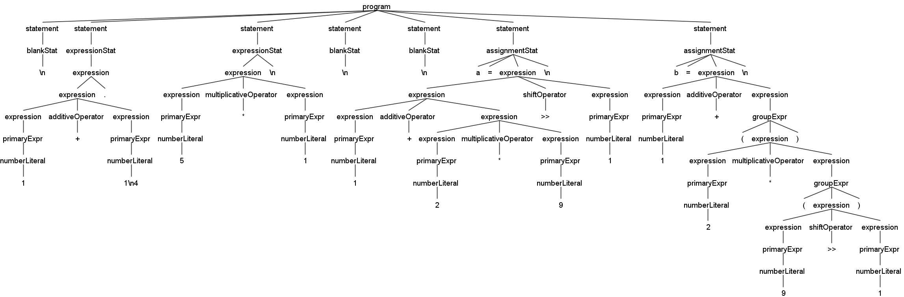

# Python ANTLR4 Grammar

Lexer and Parser rules for Python programming language using ANTLR4 Grammar.

> ***Note***: The *ANTLR4 Grammar* is not fully correct.

## Tokens

See the [Python Lexer Rules](src/PythonLexerRules.g4) antlr4 file to understand about the tokens used.

## Demo

### Assignment Operators

Normal assignment operators and augmented assignment operators.

### Import Statements

Global expressions and Import statements.

### Test Expression

## Contributing

